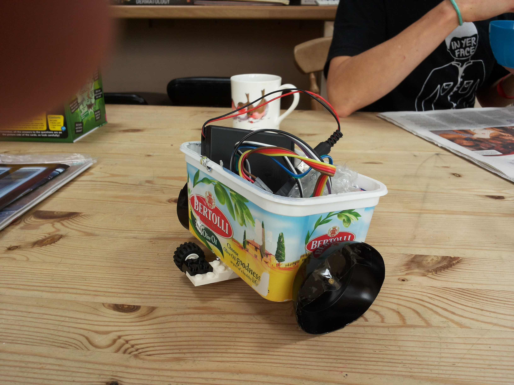
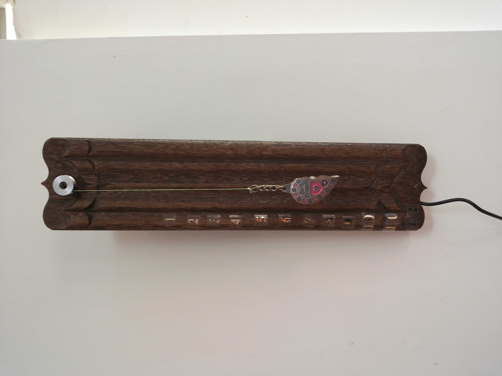

# Arduino
arduino projects

car - a simple turtle like three wheeled car using a 28bjy48 stepper motor for each of the two main wheels.

clock-\[1-6\] - a stick clock inspired by Japanese clock designs from the Endo period. Time is represented linearly by a descending weight. Uses a ds1307 RTC to keep time and a 28bjy48 stepper motor to slowly unwind the weight over twelve hours. At the end of the twelve hours the weight is automatically wound back up. To add slightly more indication of the passing of time, as the clock passes each hour boundary the motor winds back a little and then forward again which is enough to generate an audible change from the motor. The hardest part of this script was the conversion from seconds to turns. Naively you'd want to add up hours minutes and seconds and then divide to get the number of turns and sub turns (the motor can do 512 steps in a revolution) but since the Arduino only does 16 bit arithmetic doing this with integers quickly leads to overflows. At the loss of some precision I just opted for using floats.

 
